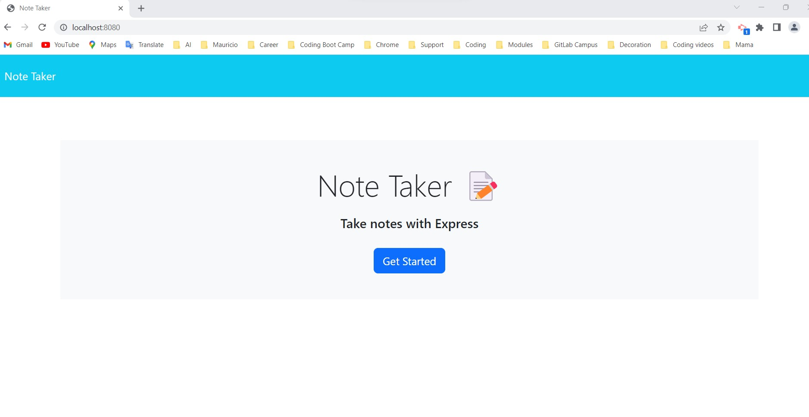
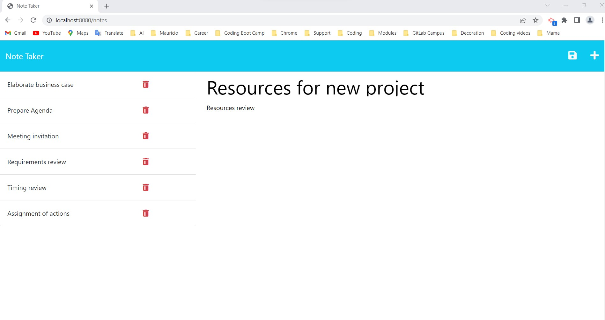
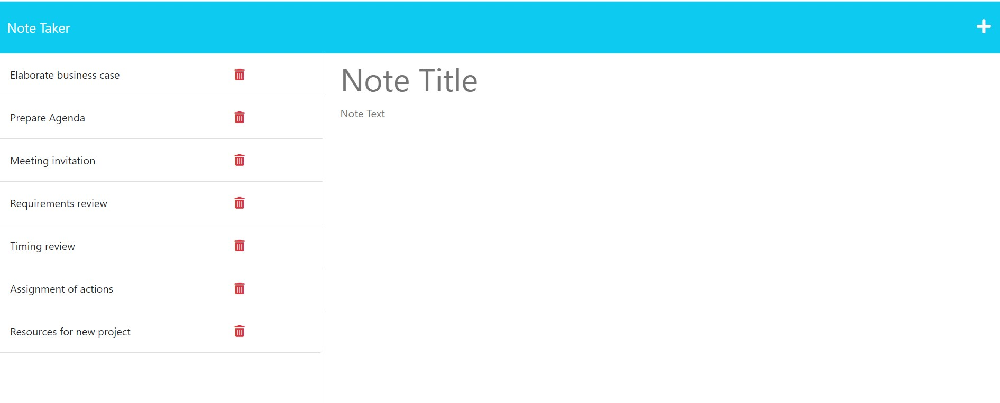
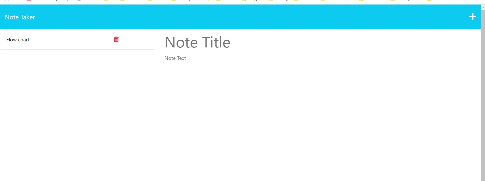
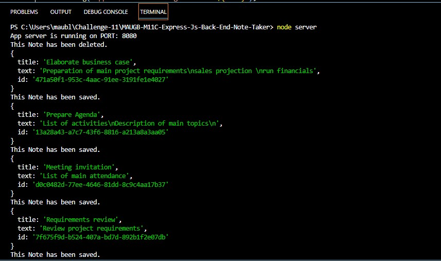

# MAUGB-M11C-Express-Js-Back-End-Note-Taker
Application to write and save notes using Express back end

## Description

This application is a Note taker used for write and save notes using front-end to get the information from the user and the back-end by Express.js. 
Notes information is saved on a database using a JSON file.
User can create , save and delete multiple notes as needed.

Create an application that allows user to take notes of multiple activities.
The application used front end landing page HTML and JavaScript.
On the back end is using NodeJS, ExpressJS, and server routing for application and html routes.

User can organize easily their task and save the notes.
Communication between front end and back end using server set-up and routings.

This program shows the use of NodeJS as backend JavaScript to be able to execute the JavaScript code outside of a web browser. Connection between front end HTML landing page and the processing of data using JSON file.  This program allows us to utilize additional packages npm  ExpressJS and path.

I learned the use of NodeJS to write the main index file using JavaScript.
Create a back-end application, set-up a server . Express static, and server routes for Application and HTML. 
Using the local port as listener. 
Use of uuid for unique identification uuid  8.3.2, use of express 4.18.12
API Get , Post request, write and delete information into a JSON file. 

## Table of Contents (Optional)

- [Installation](#installation)
- [Usage](#usage)
- [Credits](#credits)
- [License](#license)

## Installation

This Application can be use the link deployed by Heroku, please use the corresponding link below.

Heroku Deployment Link:

https://serene-inlet-45208.herokuapp.com/

Other option  to use this application is to clone the application.
Run npm install express
Use the file server.js 
Run node server to start the application; application will run locally on the indicated port

This program runs under node.js.  

Clone the repository.

Repository location: https://github.com/MauricioGB1/MAUGB-M11C-Express-Js-Back-End-Note-Taker

Proceed to clone this repository.  Open in integrated terminal and then run : node index.js
Install npm install express.
You can run the server.js file from the integrated terminal. By typing node server.js.

## Usage

Provide instructions and examples for use. Include screenshots as needed.

Use application under the following link:

https://serene-inlet-45208.herokuapp.com/

Landing page for Note taker application.
Please click "Get Started" button to run the application.

Example of Notes and activities saved on the application.

You can enter additional Notes typing on the Note section for the title.
On the note text section, please enter the activities.

Notes can be deleted click on teh trash can image to delete teh note 

Saving notes, application running in local port

deleting notes application on local server

## Credits

Generate license badge: https://shields.io/ .  
- Use of NodeJS   16.16.0
- Use of Express JS  v4.18.2
- Use of Path 0.12.7
- Use of uuid 8.3.2
- Use of JavaScript

## License

This program runs under the MIT license.

   
  

## Features

User input collection
Application deployed running from internet.
Data for each note is typed and saved into JSON file
Data for each note and activities can be deleted by user.
Routers created for communication between front-end and back-end.

## How to Contribute

If you would like to contribute please send an e-mail to gomezb_mauricio@hotmail.com. Please share your GitHub repository name and your message.

## Tests

Heroku   scripts": { "test": "echo \"Error: no test specified\" && exit 1"  }